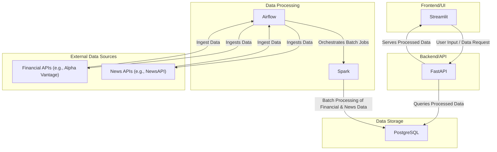
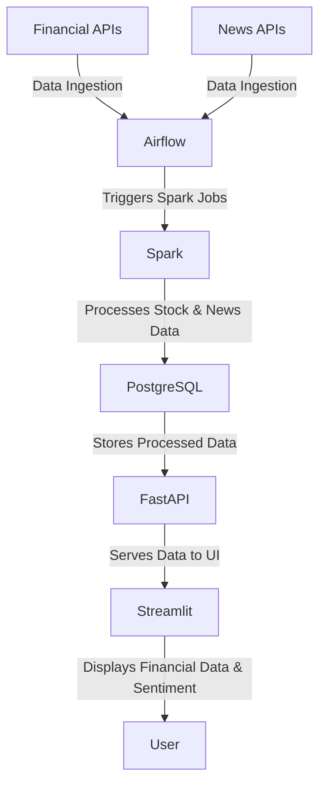
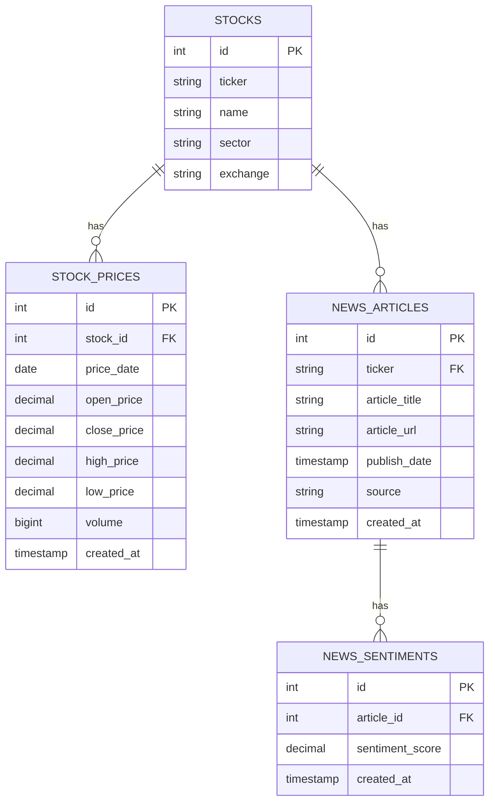

## Architecture Diagram

## Data Flow Diagram

## Entity Relationship Diagram

## Instructions
1. Create a `.env` and add API Keys for Alphavantage and FMP
```
ALPHAVANTAGE_API_KEY=XXXX
FMP_API_KEY=XXXX
``` 